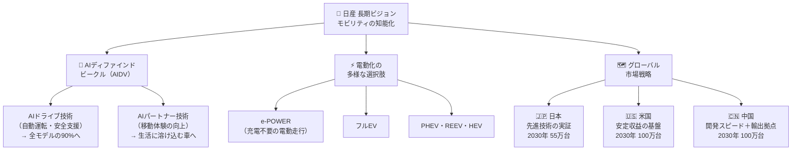
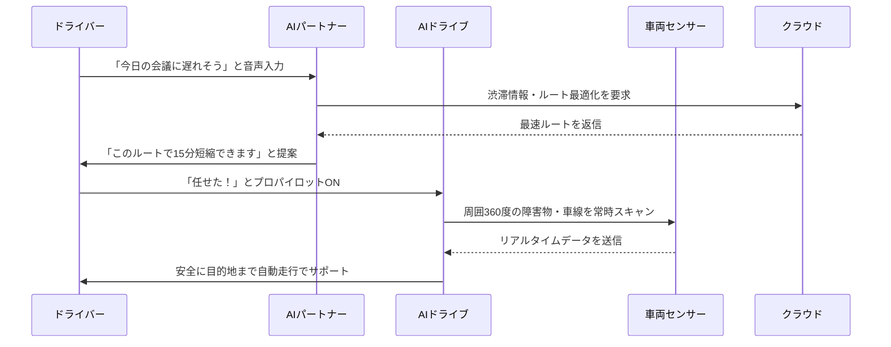

## 日産の長期ビジョンが面白い！AIが90%の車に乗る未来と3つの市場戦略

本ページはプロモーションが含まれています

---

## 1. ざっくり言うと？（要約）

- **AIが車の"脳みそ"になる時代が来る**：日産は将来的にラインアップの約90%の車にAIドライブ技術を搭載する計画を発表しました。
- **車の種類を56→45に絞り、選ばれる車だけ作る**：稼げないモデルをバッサリ切り捨て、本当に売れる・必要な車に集中投資するという大胆な戦略転換です。
- **日本・米国・中国を"3本柱"にした世界戦略へ**：この3市場を中心に、技術・生産・販売を一体化させ、2030年度に向けてグローバルで復活を目指しています。

---

## 2. もっと詳しく！（深掘り）

### AIが車を「賢い移動パートナー」に変える

今回のビジョンの一番の目玉は**「AIディファインドビークル（AIDV）」**という考え方です。難しそうに聞こえますが、要は「AIが車の全体をコントロールする、賢い次世代カー」のことです。

スマートフォンに置き換えて考えてみてください。昔の携帯電話は「電話とメールだけ」でしたが、スマホになってから「カメラ・地図・音楽・決済…」と何でもこなせるようになりましたよね。AIDVはまさにそれで、車が「ただ走るだけの機械」から「移動中も生活を豊かにしてくれるパートナー」に進化します。

AIDVには2つの顔があります：

- **AIドライブ技術**：自動運転や高度な運転支援。ドライバーの代わりに車が安全を守ってくれる技術。
- **AIパートナー技術**：移動中の体験を豊かにする技術。例えば「今日の会議資料を音声で読み上げてくれる」「気分に合わせた音楽を自動で流してくれる」といったイメージです。

### 「電気で走る選択肢」を大幅に増やす

電動化においては日産独自の**e-POWER**が中心です。e-POWERとは、ガソリンで発電しながらモーターで走る仕組み。「充電スタンドを探さなくていいのに、EVみたいにスムーズに走れる」のが最大の魅力です。

さらに今回は「全員EV化」という一辺倒な戦略をやめ、お客さんの事情に合わせて以下の選択肢を揃えます：

| パワートレイン | こんな人に向いている |
|---|---|
| e-POWER | 充電インフラが少ない地域の人 |
| フルEV | 自宅充電できる都市部の人 |
| PHEV・REEV | 長距離も走りたいが電動も試したい人 |
| フレーム車HEV | 山道や悪路もガッツリ走りたい人 |

### 56車種→45車種！「選択と集中」の経営判断

日産はかつて「たくさん車種を出せば誰かに刺さる」という戦略をとっていました。しかし現実は「どれも中途半端」になり、経営が苦しくなった一因でもあります。今回は**11モデルを廃止して45車種に絞り込み**、各モデルの役割を明確にします。

4つのカテゴリーは以下の通りです：

- 🔴 **ハートビートモデル**：日産のブランドを象徴する「顔」（スカイライン、エクステラなど）
- 🔵 **コアモデル**：世界中でコンスタントに売れる「稼ぎ頭」（エクストレイル、ジュークEVなど）
- 🟢 **成長モデル**：新しい市場や需要を開拓する「切り込み隊長」
- 🟡 **パートナーモデル**：提携先と共同で市場をカバーする「協調型」

---

### 構造をビジュアル解説（図解）



---

## 3. これだけは知っておきたい用語集

**① AIディファインドビークル（AIDV）**
「AIが設計・制御する車」のこと。スマホに例えると、昔の「電話専用機」ではなく「アプリで何でもできるスマートフォン」のような車のことです。走るだけでなく、AIが運転を助け、生活も豊かにしてくれます。

**② e-POWER**
日産独自の電動システム。ガソリンで発電して、その電気でモーターを動かして走ります。「充電スタンドがなくても、EVのような滑らかな走り心地が楽しめる」のが特徴。EVへの移行ステップとしても最適です。

**③ プロパイロット（次世代）**
高速道路などでの運転をサポートする日産の自動運転支援システム。今回の発表では、2027年度末までに「エンド・ツー・エンドの自動運転」、つまり「出発から到着まで全部AIが対応できる」レベルへ進化させる計画です。

---

## 4. 【まず読むべき1冊】理解が一気に深まる本

> 💡 ここまで読んで「もっと知りたい」と思ったあなたへ

AIが車を動かし、産業を再定義しようとしているこの瞬間。「なんとなくすごそう」で終わらせるのはもったいない！次のページで「自分の仕事や生活にどう関係するか」を考えるための"武器"を手に入れてください。

* **『生成AI時代のモビリティ革命』に近い1冊として：**
**『ChatGPT vs. 未来のない仕事をする人たち』**（青野慶久・著、PHP研究所）

  - **この記事とのつながり**：日産がAIで車を変えようとしているのと同じく、AIはあらゆる産業・職業を変えようとしています。日産のAIDVが「車をスマート化する」ように、あなた自身の仕事もAIによって再定義される可能性があります。この本はその現実を正面から見据えた一冊です。
  - **読むとこうなる**：「AIに仕事を奪われる」恐怖から「AIをどう使って価値を生み出すか」という攻めの発想に切り替えられます。日産のビジョンを聞いて「自分はこれからどう動けばいい？」と感じたなら、まさにこの本が答えへの道筋を示してくれます。
  - **こんな人に刺さる**：AIの波に乗り遅れたくないビジネスパーソン、自動車業界・製造業・IT業界で働く人
  - **難易度**：★★☆☆☆

---

## 5. なぜこれが生まれたの？（ルーツ・背景）

### 日産はなぜ「再建」が必要だったのか

2019年のゴーン事件以降、日産は長期間にわたって経営が迷走しました。「とにかく台数を増やせ」という過去の拡大路線が裏目に出て、収益性が低下。さらにコロナ禍での販売落ち込みや、EV競争での出遅れが重なりました。まるで「全部盛りのラーメン屋が、どの味も中途半端で客が来なくなった」状態です。

### 「Re:Nissan」という下地があったから今がある

今回の長期ビジョン発表の前段として、日産は**「Re:Nissan（リ：ニッサン）」**という構造改革プランを実行中でした。工場の生産能力を絞り、不採算事業から撤退し、体力を回復させる「ダイエット期間」です。この努力が計画通りに進んでいるからこそ、今回「未来に向けて走り出す」宣言ができたのです。

### AIと電動化の融合という世界トレンド

世界の自動車業界は今、「SDV（ソフトウェア・デファインド・ビークル）」という概念が主流になりつつあります。テスラがソフトウェアのアップデートで車の性能を上げ続けているように、「売った後もアップデートで進化し続ける車」が当たり前になる時代。日産はここにAIを組み合わせた「AIDV」という独自の答えを出したのです。

---

## 6. どんな仕組みなの？（技術解説）

### 仕組みをわかりやすく解説

AIDVの仕組みは、スマートフォンのアプリ構造と似ています。

1. **ハードウェア（車体・センサー）**：スマホでいう「本体・カメラ・マイク」
2. **AIソフトウェア**：スマホでいう「iOS・Android」
3. **AIドライブ機能**：「カーナビアプリ」や「安全支援アプリ」
4. **AIパートナー機能**：「Siri」や「Googleアシスタント」のような対話型AI

この4層が連携することで、「走る」「安全を守る」「生活を助ける」の3つを同時に実現します。しかも、ソフトウェアは後からアップデートできるので、**買った時より賢くなり続ける車**が実現します。

### 動きをシミュレーション（図解）



---

## 7. 明日の仕事にどう活かす？（実務での活用）

### 自動車業界で働く人：「次の波」に乗る準備を今すぐ

日産のAIDV戦略は、自動車業界全体が「ハードウェアの競争」から「ソフトウェア・AI競争」に移行するサインです。整備士・ディーラー・部品メーカーで働く人は、「AIやソフトウェアの基礎知識」を今のうちに身につけておくことで、次の10年で大きく差がつきます。

### ビジネスパーソン全般：「選択と集中」という経営の教科書

日産が56車種→45車種に絞り込んだ判断は、どんなビジネスにも応用できる普遍的な考え方です。「あれもこれもやる」より「これだけは誰にも負けない」を作る方が、結果的に強い。自分の仕事・サービス・スキルの"棚卸し"に今すぐ使えるヒントです。

### 投資家・株式投資に興味がある人：ターンアラウンドのシグナルを読む

「Re:Nissan→長期ビジョン発表」という流れは、企業再建（ターンアラウンド）の典型的なパターンです。「コスト削減 → 基盤固め → 成長戦略発表」という3ステップを踏んでいる企業は、株式市場でも注目されやすいタイミングです。今回の発表を「単なるニュース」ではなく「投資判断の材料」として読む視点を持つと、経済ニュースがもっと面白くなります。

### テクノロジー好き・就活生：「AIを使う側」の最前線企業を知る

就職・転職先を考えるとき、「AIをどう活用しているか」は企業選びの重要な軸になります。日産のように「AIを車の中核に据える」宣言をしている企業は、これからAI・ソフトウェアエンジニア・データサイエンティストの採用を大幅に増やすはずです。キャリアの方向性を考えるヒントにもなります。

---

## 8. あとがき

正直なところ、日産というブランドに対して「昔の名前で出ています」的なイメージを持っていた方も多いのではないでしょうか。私自身もそうでした。でも今回の長期ビジョンを読んで、少し見方が変わりました。

「AIが車を定義する」という発想は、単なるマーケティングコピーではなく、本気で自動車の概念を再発明しようとしている意志を感じます。スカイラインというアイコンを「ハートビートモデル」として残しながら、一方で中国を輸出拠点として活用するグローバル感覚。古いものと新しいものを同時に走らせる、その緊張感こそが「リアルな大企業の戦略」だと思います。

あなたが自動車業界にいるかどうかに関わらず、「AIが産業をどう変えるか」を考えることは、これからの10年を生き抜くための必須教養です。この記事が少しでもその入口になれたなら嬉しいです。ぜひ関連書籍もチェックしてみてください。理解が行動に変わりますよ。

## 参考・引用元
- [日産自動車 公式プレスリリース「モビリティの知能化で、毎日を新たな体験に」](https://global.nissannews.com/ja-JP)

---

## 9. 【行動したい人へ】さらに学びを深める書籍

> 📚 「理解して終わり」ではなく「実務で使えるレベル」を目指す人へ

### 書籍5選

* **『生成AIで世界はこう変わる』**（今井翔太・著、SBクリエイティブ）
  - **読むと何ができるようになるか**：生成AIが産業・社会・仕事をどう変えるかを体系的に理解でき、日産のAIDVのような動きがなぜ起きているかを説明できるようになる
  - **こんな人におすすめ**：AIの全体像を把握したいビジネスパーソン、自動車・製造業界でAI活用を検討している人
  - **読んだ後どんな未来になるか**：ニュースを読むたびに「これはAIのどの技術が使われているか」が見えるようになり、先読み力が格段に上がる
  - **難易度**：★★☆☆☆

* **『自動運転の未来：AIと車が変える世界』に近い1冊：**
**『図解即戦力 自動車業界のしくみとビジネスがこれ1冊でわかる教科書』**（川端由美・著、技術評論社）
  - **読むと何ができるようになるか**：EVや自動運転の技術背景から、サプライチェーン・ビジネスモデルまで一気通貫で理解でき、業界の動向を自分の言葉で説明できるようになる
  - **こんな人におすすめ**：自動車業界への就職・転職を考えている人、取引先に自動車メーカーがいるビジネスパーソン
  - **読んだ後どんな未来になるか**：商談や会議で「業界の人」として通用する知識ベースが手に入る
  - **難易度**：★★☆☆☆

* **『ChatGPT/GPT-4を使いこなすためのプロンプトエンジニアリング入門』**（中村朱里・著、秀和システム）
  - **読むと何ができるようになるか**：AIに「うまく指示を出す」技術が身につき、業務効率化や情報収集のスピードが劇的に上がる
  - **こんな人におすすめ**：日産のAIパートナー技術のような「AIとの対話」に興味が湧いた人、今すぐAIを仕事に使いたい人
  - **読んだ後どんな未来になるか**：「AIを使いこなせる人」として社内外で重宝される存在になれる
  - **難易度**：★★☆☆☆

* **『EV・電動化時代のビジネス戦略』に近い1冊：**
**『2030年 電気自動車の世界』**（木野龍逸・著、PHPビジネス新書）
  - **読むと何ができるようになるか**：EVシフトの世界的な流れと日本メーカーの立ち位置を客観的に把握でき、日産・トヨタ・テスラの戦略を比較して語れるようになる
  - **こんな人におすすめ**：e-POWERやEVの違いが気になった人、エネルギー・環境ビジネスに関心がある人
  - **読んだ後どんな未来になるか**：「次に買う車はどれにすべきか」という個人的な判断から、業界の未来投資まで、幅広い場面で役立つ視点が手に入る
  - **難易度**：★★★☆☆

* **『SDV（ソフトウェア・デファインド・ビークル）革命』に近い1冊：**
**『ソフトウェアファースト』**（及川卓也・著、日経BP）
  - **読むと何ができるようになるか**：「ハードではなくソフトで価値を作る」という現代のビジネス原則を深く理解でき、日産のAIDV戦略がなぜ正しい方向かを論理的に説明できるようになる
  - **こんな人におすすめ**：製造業・ものづくり企業でDXを推進したい人、ソフトウェアビジネスの本質を知りたい人
  - **読んだ後どんな未来になるか**：デジタル変革を「コスト削減の手段」ではなく「価値創造の武器」として捉えられる経営視点が身につく
  - **難易度**：★★★☆☆

---

## zennで使えるハッシュタグ

```
#日産 #NISSAN #AIDV #自動運転 #EV #電動化 #ePOWER #AI #モビリティ #自動車テック
```