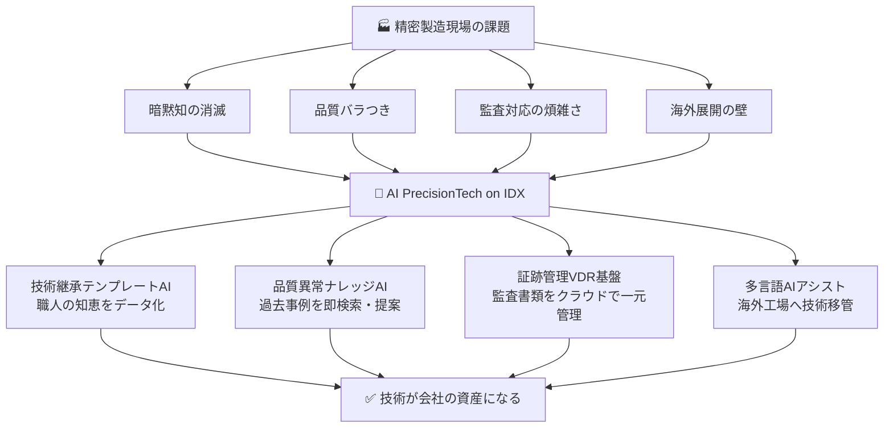
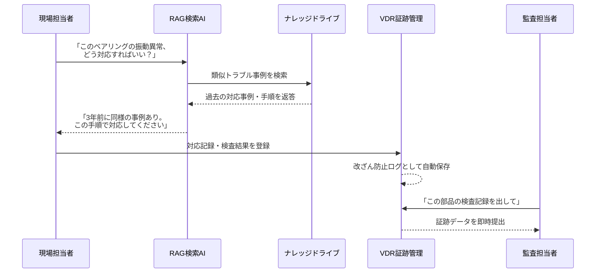

## 日本の職人技をAIで守る！精密製造業が抱える3つの深刻問題を解決する新ツール登場

本ページはプロモーションが含まれています

---

## 1. ざっくり言うと？（要約）

- 🔧 日本が世界に誇る「精密部品づくり」の現場では、熟練職人の引退による**技術の消滅・品質のバラつき・書類管理の煩雑さ**という3大問題が深刻化している。
- 🤖 AIデータ株式会社が新リリースした**「AI PrecisionTech on IDX」**は、職人の頭の中にある「暗黙知」をAIに学ばせ、誰でも同じ品質で仕事ができる環境を作るツール。
- 🌏 技術文書の自動作成・監査対応の自動化・多言語対応まで一気通貫でカバーし、**海外展開の壁**も突破できるのが最大の特徴。

---

## 2. もっと詳しく！（深掘り）

### 「職人の頭の中」が消えていく問題

日本の小型モーターやベアリング（機械がスムーズに動くための精密な回転部品）は、世界トップシェアを誇ります。しかしその品質を支えているのは、長年の経験で培った「熟練職人の感覚・判断」です。

問題は、その職人たちが次々と定年を迎えていること。「この部品はこの角度で削ると微妙にズレる」「このロットは気温が高い日に検査すべき」──そんな**言葉にしにくい知恵（＝暗黙知）**が、職人と一緒に引退してしまっているのです。

### 「人によって品質がバラバラ」という製造業の悪夢

同じ工場、同じ機械を使っているのに、担当者が違うだけで製品の精度がズレてしまう。これが「品質バラつき問題」です。一流レストランのシェフが休んだら料理の味が変わってしまうようなもの。製造業では、これが顧客クレームや製品の作り直しコストに直結します。

### 「紙の山」との戦い：監査対応に追われる現場

ISO規格や顧客監査への対応では、「いつ・誰が・どの部品を・どう検査したか」を証明する書類が大量に必要です。しかし多くの工場では、その記録が**紙・個人のPC・引き出しの中**にバラバラに存在しています。監査のたびに担当者が徹夜で書類を探す──そんな光景が今も珍しくありません。

### 「AI PrecisionTech on IDX」が解決する仕組み

今回リリースされたツールは、これら3つの問題をまとめて解決します。

| 課題 | 解決策 |
|------|--------|
| 暗黙知の消滅 | 職人のノウハウをテンプレート化→AIが即検索 |
| 品質バラつき | 工程を標準化・AIが類似トラブルを即提案 |
| 監査書類の煩雑さ | クラウドで一元管理・AIが自動整理 |
| 海外展開の壁 | 多言語AIアシストで技術移管をサポート |

### 構造をビジュアル解説（図解）



---

## 3. これだけは知っておきたい用語集

### 🔑 暗黙知（あんもくち）
「言葉にできないけど体が知っている知識」のこと。自転車の乗り方は言葉で教えにくいですよね？職人の「この感触なら大丈夫」という判断も同じ。AIはこれをデータとして記録・再現しようとしています。

### 🔑 RAG（ラグ）検索
「AIが大量の社内資料の中から、質問に一番合った答えを瞬時に見つける技術」のこと。図書館の司書が何万冊もの本から必要な情報を数秒で探してくれるイメージです。

### 🔑 VDR（ブイディーアール）基盤
「Virtual Data Room（バーチャル・データ・ルーム）」の略。重要な書類をクラウド上の「鍵付き部屋」で安全に管理し、誰がいつ見たかも記録できる仕組みです。企業の監査やM&Aでよく使われます。

---

## 4. 【まず読むべき1冊】理解が一気に深まる本

> 💡 ここまで読んで「もっと知りたい」と思ったあなたへ

* **『製造業のDX 現場から変えるデジタル革新』**（日経BP編）
  - **この記事とのつながり**：「現場の暗黙知をどうデジタルに変換するか」という本記事の核心テーマに、実際の製造業DX事例を交えながら正面から答えてくれる一冊です。AI導入の前に「なぜ現場がデジタル化を嫌がるのか」という人間側の問題も丁寧に解説されており、ツール導入前の必読書です。
  - **読むとこうなる**：「うちの工場でAIを入れるならどこから始めるべきか」が自分の言葉で説明できるようになります。社内の説得材料としても使えます。
  - **こんな人に刺さる**：製造業の現場リーダー・DX推進担当者・中小製造業の経営者で「AIは聞いたことあるけど何から始めればいいかわからない」と感じている人
  - **難易度**：★★☆☆☆

---

## 5. なぜこれが生まれたの？（ルーツ・背景）

### 日本製造業の「2025年問題」

団塊の世代が後期高齢者となる2025年以降、製造現場では大量の熟練技術者が引退します。経済産業省もこの問題を深刻視しており、「技能継承」は今や国家レベルの課題です。日本の精密部品は世界のスマートフォン・EV・医療機器に使われており、品質が落ちれば日本のサプライチェーン全体に影響します。

### 「ISO対応」が中小企業の首を絞めている現実

精密部品メーカーがトヨタや大手電機メーカーと取引するには、ISO/TS 16949などの国際品質規格への準拠が求められます。しかし、その証跡（証明書類）を管理するシステムを独自に構築するコストは中小企業には重荷でした。「品質は一流、書類管理は昭和」という現場が今でも多く存在します。

### AIデータ社が「IDX」プラットフォームを選んだ理由

同社はもともと17年連続でデータ管理ツールの販売実績を持つ企業です。「データを守る」という原点から、「データを使って技術を次世代に渡す」という発想に進化したのが、今回のAIソリューションです。改ざん防止機能（VDR基盤）はもともとデータ保全の技術から来ており、法律・監査の世界での信頼性が既に実証されています。

---

## 6. どんな仕組みなの？（技術解説）

### 仕組みをわかりやすく解説

「AI PrecisionTech on IDX」は、大きく3つのエンジンが連携して動いています。

① **ナレッジエンジン**：職人のノウハウ・過去のトラブル事例・仕様書などを「ナレッジドライブ」という"デジタル知識の倉庫"に格納します。

② **RAG検索エンジン**：現場の担当者が「この不良、前にも見た気がする」と思ったとき、自然な言葉で質問するだけで、倉庫の中から類似事例をAIが瞬時に見つけ出して提案します。

③ **VDR証跡エンジン**：すべての記録（検査・点検・教育）が自動でクラウドに保存され、誰がいつ何をしたか改ざんできない形で管理されます。監査が来てもボタン一つで証跡を提出できます。

### 動きをシミュレーション（図解）



---

## 7. 明日の仕事にどう活かす？（実務での活用）

### 【製造現場リーダー向け】ベテランが休んでも品質を落とさない

来月ベテランが産休・育休・定年を迎える──そんな時でも、事前にナレッジドライブに知識を格納しておけば、後任の若手がAIに質問するだけで同じ品質で作業できます。「あの人がいないと回らない」を卒業する第一歩です。

### 【品質保証・QC担当向け】クレーム対応スピードが激変する

顧客から「この部品、規格外じゃないか？」とクレームが来た瞬間、担当者がAIに質問すれば、過去の同様事例・対応手順・検査データが数秒で表示されます。「社内確認します」と言ってから3日待たせるような対応が、その場で完結するようになります。

### 【経営者・DX推進担当向け】ISO監査の準備コストをゼロに近づける

年に一度の監査のたびに、書類をかき集めるために残業が発生していませんか？VDR基盤で日常的に証跡が蓄積されていれば、監査当日は「出力ボタンを押すだけ」になります。残業コストの削減効果は導入初年度から実感できるレベルです。

### 【海外展開を考える経営者向け】言語の壁を超えた技術移管

タイやベトナムに工場を作ったとき、技術者を3ヶ月常駐させて教える──そのコストと品質リスクが、多言語AIアシストによって大幅に圧縮されます。マニュアルの多言語展開も、AIが自動でドラフトを生成します。

---

## 8. あとがき

「職人の技は見て盗め」という言葉が日本にはあります。でも、人口が減り、引退のスピードが加速する今の時代に、その哲学だけで会社を守れるでしょうか。

私が今回の「AI PrecisionTech on IDX」を見て感じたのは、「AIが人間の技を奪う」のではなく、「AIが人間の技を次の世代に手渡す橋渡し役になる」という可能性です。熟練職人が40年かけて磨いてきた知恵は、その人の引退と共に消えてはいけない。それは会社の資産であり、日本のものづくり文化そのものです。

技術継承・品質管理・監査対応──どれも地味に見えますが、これらをきちんと解決した企業だけが、次の10年も世界市場で戦い続けられると思います。この記事が、あなたの現場に「変わるきっかけ」を届けられたなら嬉しいです。

この記事が役立ったと感じたら、ぜひ関連書籍もチェックしてみてください。知識を自分の言葉に変えることで、理解が行動に変わりますよ。

---

## 参考・引用元
- [AIデータ株式会社プレスリリース：AI PrecisionTech on IDX リリース発表](https://www.aidata.co.jp/)

---

## 9. 【行動したい人へ】さらに学びを深める書籍

> 📚 「理解して終わり」ではなく「実務で使えるレベル」を目指す人へ

### 書籍5選

* **『ChatGPT×製造業 現場で使えるAI活用術』**（著：DX推進研究会）
  - **読むと何ができるようになるか**：製造現場の具体的な業務フローにAIを組み込む手順が体得でき、「うちの工場でどこから始めるか」を自分で設計できるようになります
  - **こんな人におすすめ**：AI活用に興味はあるが「製造業に特化した事例」が知りたい現場リーダー・DX推進担当者
  - **読んだ後どんな未来になるか**：社内提案書の解像度が格段に上がり、経営層を動かせるレベルの言語化ができるようになります
  - **難易度**：★★☆☆☆

* **『知識経営の実践：暗黙知をデータに変える組織づくり』**（著：野中郁次郎・関連研究者）
  - **読むと何ができるようになるか**：「なぜ職人の知恵はデータにしにくいのか」という根本を理解し、ナレッジマネジメントの設計思想が身につきます
  - **こんな人におすすめ**：技術継承プロジェクトを担当している人・人材育成部門のリーダー
  - **読んだ後どんな未来になるか**：AIツールを「ただ入れる」ではなく、組織文化として根付かせるための設計力が手に入ります
  - **難易度**：★★★☆☆

* **『生成AI時代のDX戦略：中小製造業の生き残り術』**（著：経営×AI研究チーム）
  - **読むと何ができるようになるか**：大企業向けではなく中小・中堅製造業の現実予算・現実リソースでのAI導入ロードマップを描けるようになります
  - **こんな人におすすめ**：「うちは大企業じゃないからAIは無理」と思っている中小製造業の経営者・管理職
  - **読んだ後どんな未来になるか**：自社に合ったスモールスタートの計画書が作れるようになり、補助金活用の視点も養われます
  - **難易度**：★★☆☆☆

* **『ISO品質マネジメントとデジタル証跡管理：監査で困らない仕組みの作り方』**（著：品質管理実務研究会）
  - **読むと何ができるようになるか**：ISO規格が要求する証跡の「実態」を理解し、デジタルツールで効率的に準拠する設計ができるようになります
  - **こんな人におすすめ**：品質保証部門・QC担当者・ISO内部監査員
  - **読んだ後どんな未来になるか**：監査前の「書類探し地獄」から解放され、日常業務の中で証跡が自然に積み上がる仕組みが作れます
  - **難易度**：★★★☆☆

* **『RAG・LLM実践ガイド：社内ナレッジをAIで活かす技術』**（著：AIエンジニアリング研究所）
  - **読むと何ができるようになるか**：RAG検索の仕組みを技術的に理解し、自社の社内文書・マニュアルをAIに学ばせるための要件定義ができるようになります
  - **こんな人におすすめ**：AIツールを「使う側」から「設計する側」に回りたいIT担当者・エンジニア
  - **読んだ後どんな未来になるか**：ベンダーの説明を「受け身で聞く」から、要件を自分で提示して主導権を持てる立場になれます
  - **難易度**：★★★★☆

---

## zennで使えるハッシュタグ

```
#製造業DX #AI活用 #技術継承 #暗黙知 #ナレッジマネジメント #品質管理 #RAG #生成AI #スマートファクトリー #IoT製造業
```