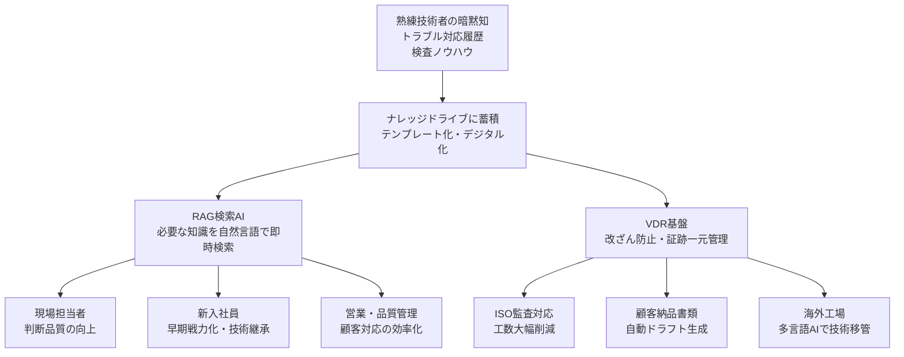
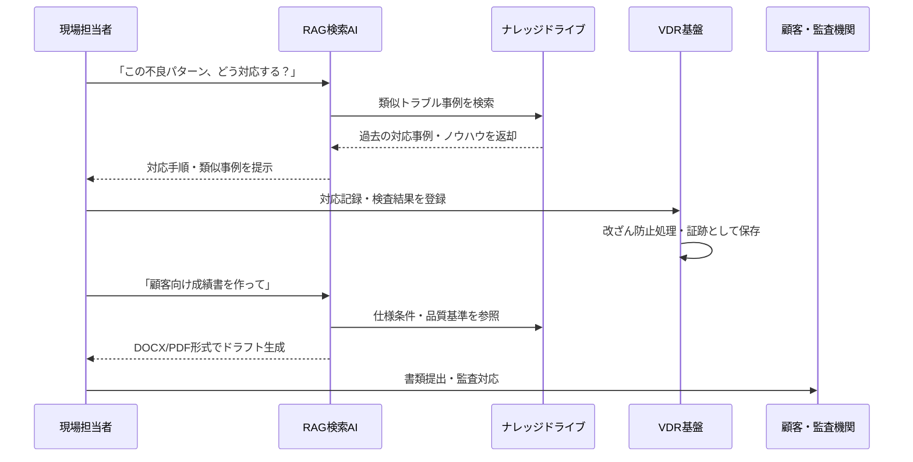

## 職人の暗黙知をAIで守る、精密製造業が変わる3つの革命

本ページはプロモーションが含まれています

## 1. ざっくり言うと？（要約）

- 日本の精密製造業（モーター・ベアリング・精密部品など）が抱える「職人技の消滅リスク」「品質のバラつき」「監査書類の山」という3大悩みを、AIで一気に解決するサービスが登場しました。
- AIデータ株式会社が提供する「AI PrecisionTech on IDX」は、熟練技術者の頭の中にある知識をデジタル化し、誰でも即座に引き出せる仕組みを作ります。
- 書類作成の自動化・監査対応の効率化・海外工場への技術移管まで、製造現場が「人に頼りきり」から脱却するための総合AIプラットフォームです。

## 2. もっと詳しく！（深掘り）

### 職人の頭の中を「AIの引き出し」に変える

日本の精密部品産業が世界トップシェアを維持できているのは、一人ひとりの熟練技術者が長年かけて体得した「なんとなくこの感触なら合格」「このときはこの加工条件を少し変える」といった暗黙の知識のおかげです。

ところが、その職人さんが引退してしまったら？　その知識は頭ごと会社から消えてしまいます。まるで、レシピを暗記したシェフが突然やめてしまったレストランのようなものです。

AI PrecisionTech on IDXは、その暗黙知をテンプレートとしてデジタルに書き起こし、AIが必要なときに瞬時に引き出せるようにします。新入社員でも、ベテランの経験値に近い判断ができる環境が整うわけです。

### 品質バラつきを「仕組み」で封じ込める

品質のバラつきが起きる最大の原因は「担当者によって判断基準がちがう」ことです。AさんとBさんが同じ部品を検査しても、合否の基準が微妙にずれていれば、不良品が流出したり、逆に良品を過剰にはじいたりしてしまいます。

このシステムでは、過去のトラブル事例や対応履歴をすべてAIが記憶し、「このケースは過去にこう判断した」という前例をリアルタイムで提示します。人間のあいまいな記憶に頼らず、過去の正解を常に参照できる状態が作れるのです。

### 監査の「書類地獄」をAIで終わらせる

ISO規格や顧客監査への対応は、製造現場の担当者にとって大きなストレスです。紙の書類や個人のパソコンに散らばった記録をかき集め、整理し、報告書を作る作業は、本来の製造業務とはまったく別の「別の仕事」として現場に重くのしかかっています。

AI PrecisionTech on IDXは、品質記録・検査ログ・教育記録をクラウド上で一元管理し、AIが必要な証跡を瞬時に検索して整理します。さらに、顧客向けの仕様書や成績書のドラフトまで自動生成してくれるため、書類作成にかかる時間を劇的に圧縮できます。

### 構造をビジュアル解説（図解）

## 3. これだけは知っておきたい用語集

### RAG（ラグ）検索

「RAG」とは「Retrieval-Augmented Generation」の略で、ざっくり言うと「自分の会社の資料を読み込んだうえで答えてくれるAI」のことです。普通のAIは世の中の一般知識で答えますが、RAGは「自社の過去トラブル事例」「自社の検査マニュアル」など、会社独自のデータをもとに答えてくれます。社内専用の物知り先輩社員、と思えばわかりやすいです。

### VDR（バーチャル・データ・ルーム）

重要な書類を安全に保管・共有するためのデジタル金庫です。「誰がいつ何を見たか」「書類が改ざんされていないか」を記録し続けることができます。監査や法律対応のときに「この書類は本物で、このタイミングで作成されました」と証明できる仕組みです。

### 暗黙知（あんもくち）

文章やマニュアルに書けない「体で覚えた知識」のことです。自転車の乗り方を言葉だけで説明するのが難しいのと同じで、「このときの感触でOKかどうかわかる」という職人的な判断基準がこれに当たります。製造現場では、この暗黙知が品質を支えている一方で、引き継ぎが極めて難しいという問題があります。

## 4. 【まず読むべき1冊】理解が一気に深まる本

> ここまで読んで「もっと知りたい」と思ったあなたへ

該当するKindle書籍を確認できなかったため、このセクションは省略します。

## 5. なぜこれが生まれたの？（ルーツ・背景）

### 「失われる職人技」という時限爆弾

日本のモノづくりが世界で高く評価されてきた理由のひとつは、長年の経験で磨かれた「職人の感覚」です。しかし今、その担い手である熟練技術者の高齢化と引退が加速しています。団塊の世代が製造現場から去り始めた2010年代から、業界では「技術継承」が深刻な経営課題として認識されてきました。

マニュアルを作ればいい、と思うかもしれません。しかし暗黙知の多くは、言葉にしようとした瞬間に大事なニュアンスがこぼれ落ちてしまいます。だからこそ、AIが「会話形式で知識を引き出し、構造化する」アプローチが有効なのです。

### グローバル競争と品質証明の高度化

同時進行で起きているのが、グローバル競争の激化と品質証明要求の厳格化です。自動車部品・医療機器・航空宇宙分野では、ISO/TS規格への適合が取引条件になっています。品質記録が紙とローカルPCに散らばった状態では、もはやグローバルサプライチェーンに参加すること自体が難しくなりつつあります。

このダブルの課題に対して「AIとクラウドを組み合わせて一気に解決する」という発想が、AI PrecisionTech on IDXを生んだ原点です。

## 6. どんな仕組みなの？（技術解説）

### 仕組みをわかりやすく解説

このシステムの核心は「会社の知識を全部クラウドに入れて、AIがいつでも引き出せるようにする」ことです。手順はシンプルに3段階で考えられます。

まず「入れる」。過去のトラブル事例、ベテランのノウハウ、検査記録、仕様書などを「ナレッジドライブ」というクラウドの棚に整理して保存します。

次に「探す」。現場の担当者が「こういう不良が出たときどうすればいい？」と普通の言葉で質問すると、RAG検索AIが棚の中を高速で調べ、最も関連性の高い過去事例や対処法を提示してくれます。

そして「作る」。仕様書・成績書・監査書類のドラフトはAIが自動生成し、担当者は確認・修正するだけで完成させられます。全工程を通じて、記録は改ざん防止機能付きのVDR基盤で管理されます。

### 動きをシミュレーション（図解）

## 7. 明日の仕事にどう活かす？（実務での活用）

### 製造現場のリーダーとして使う

ラインを管理している方であれば、まず「過去トラブルのナレッジ化」から始めてみることをおすすめします。「あのときベテランのAさんがどう対応したか」という記録をAIに食わせるだけで、次世代のリーダー育成コストが大幅に下がります。新人が一人で夜勤に入っても、AIが「先輩代わり」に対応策を提示してくれる環境が作れます。

### 品質管理・QC担当者として使う

ISO監査の準備に毎回追われているなら、VDR基盤による証跡の一元管理が即効薬になります。「あの書類どこにある？」という探し物の時間がゼロになるだけで、監査前の数日間が劇的に楽になります。さらに、過去の不適合事例をナレッジ化しておくことで、同じミスを繰り返さない「組織の記憶」が完成します。

### 経営・事業開発の視点で使う

海外工場への技術移管や、新規の海外顧客への技術説明は、言語の壁と暗黙知の壁というダブルの障壁があります。多言語AIアシスト機能を活用すれば、日本の工場で積み上げた品質ノウハウをそのまま海外拠点に展開できます。「日本品質」をグローバルに届けるための橋渡し役として、このシステムを位置づけることができます。

### 営業・技術提案担当として使う

顧客から「こういう仕様に対応できますか？」「過去にこういった実績はありますか？」と問われたとき、これまでは社内の詳しい人に聞いてまわる時間が必要でした。RAG検索で過去のQCD対応事例・技術仕様書を瞬時に検索できれば、商談中にその場で回答できる「即答力」が手に入ります。

## 8. あとがき

日本のモノづくりを支えてきた「職人の技」は、数値化できないからこそ価値があり、数値化できないからこそ継承が難しかったのだと思います。それをAIが補助するという発想は、職人を置き換えるものではなく、職人の知恵を「永久保存」するためのものです。

ひとりの優れた技術者が30年かけて積み上げたノウハウが、引退と同時に消えてしまう時代は、もう終わりにできるかもしれません。それは技術者本人にとっても、会社にとっても、そして日本の産業全体にとっても、大きな意味を持ちます。

製造現場にいる方も、経営に携わる方も、「うちにも同じ課題がある」と感じたなら、まず無料のPoC相談から一歩を踏み出してみてください。その一歩が、10年後の自社の競争力を大きく変えることになるはずです。

この記事が役立ったと感じたら、ぜひ関連書籍もチェックしてみてください。理解が行動に変わりますよ。

## 参考・引用元

- AIデータ株式会社 プレスリリース「AI PrecisionTech on IDX」リリース発表

## 9. 【行動したい人へ】さらに学びを深める書籍

> 「理解して終わり」ではなく「実務で使えるレベル」を目指す人へ

### 書籍5選

該当するKindle書籍を確認できなかったため、このセクションは省略します。

## zennで使えるハッシュタグ

#AI #製造業DX #技術継承 #品質管理 #RAG #生成AI #ナレッジマネジメント #スマートファクトリー #暗黙知 #AIビジネス活用