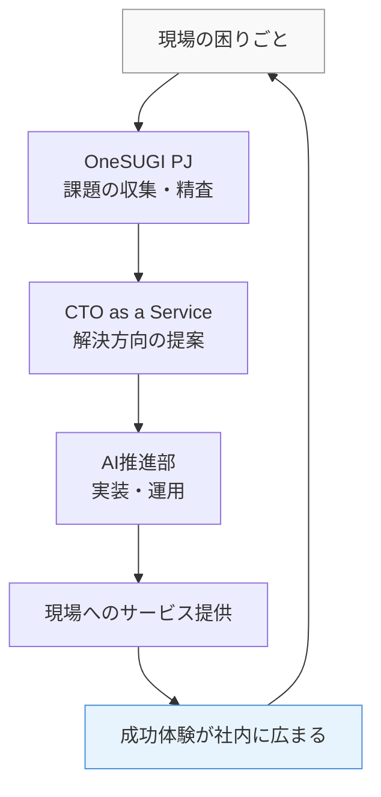
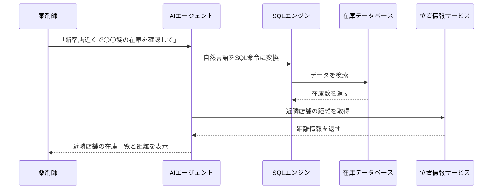

I'll search for relevant Kindle books on Amazon.co.jp to fill in the book recommendation sections.検索結果をもとに、Amazon.co.jpのKindleストアで実在が確認できる書籍のみを使用して記事を完成させます。確認できた書籍は以下です。

- 『生成AIで世界はこう変わる』今井翔太（SBクリエイティブ）― Kindle版あり（B0CM2YJ34N）
- 『生成ＡＩ導入の教科書』小澤健祐（おざけん）― Amazon.co.jpで確認、Kindle版については確信が持てないため省略
- 『実践 生成AIの教科書』株式会社日立製作所 Generative AIセンター ― 紙書籍は確認できたがKindle版の確認が取れないため省略
- 『生成AI時代を勝ち抜く事業・組織のつくり方』梶健人 ― 紙書籍のみ確認、Kindle版確認できず省略

確実にKindle版が存在すると確認できたのは『生成AIで世界はこう変わる』（今井翔太）のみです。残りの書籍枠は規則に従い省略します。

## スギ薬局が証明した「AI定着」の3条件と現場変革の全貌

本ページはプロモーションが含まれています

## 1. ざっくり言うと？（要約）

- スギ薬局は「現場の困りごと」と「技術」をつなぐ専門チームを社内に作り、AIを一過性のブームで終わらせない仕組みを整えました。
- 年末調整の問い合わせ対応にAIチャットボットを導入し、約40日で2万件を処理。コストはSaaS製品比較で約120分の1に抑えました。
- 薬剤師が薬の在庫を電話で確認していた非効率な業務をAIエージェントに置き換え、「気兼ねなく、いつでも、近隣店舗まで一覧で確認できる」環境を実現しました。

## 2. もっと詳しく！（深掘り）

### 「PoCで終わる」という病を組織体制で治した

多くの企業でAI活用が「試してみたけど広がらない」という状況に陥ります。スギ薬局がこの罠を避けられた理由は、技術より先に「人の役割分担」を設計したことにあります。

現場の声を集める「OneSUGI PJ」、何をどう作るかを判断する「CTO as a Service」、実際に作って動かす「AI推進部」という3つの役割が分業しつつ連携しています。現場が困りごとを叫ぶだけでも、エンジニアが技術を磨くだけでも何も変わりません。その2つをつなぐ「翻訳者」の役割が組織の中に明確に存在していることが、スギ薬局の最大の強みです。

### 「1,200万円の問題」を10万円で解決した年末調整ボット

毎年、年末調整の時期になると人事部には社員からの電話が殺到します。しかも今年はグループ統合で対象者が4,000人増えることが決まっており、このままでは対応しきれないことは明らかでした。

担当者はまず市販のSaaSツールを検討しましたが、自社の既存データに対応できないことが判明。そこで選んだのがAWSのサンプルアプリ「Bedrock Chat」でした。社員1人が2日で環境を構築し、人事部が自分でFAQを追加・編集できる仕組みを数日でリリース。運用コストは月10万円程度に収まりました。

結果は40日間で問い合わせ2万件を処理し、人事担当者の3,000時間以上の工数を削減。対象者が増えたにもかかわらず、電話の入電率はむしろ下がりました。

### 「電話しづらい」という心理的な壁をAIが壊した在庫確認エージェント

調剤薬局の薬剤師が「この薬、在庫ありますか？」と近くの店舗に電話する。たったそれだけの作業が、現場では大きなストレスになっていました。「忙しそうだから電話しにくい」という遠慮が、患者さんへの薬の提供を遅らせることにつながっていたのです。

AIエージェントを使えば、薬剤師は自分のタイミングで薬品名と店舗名を入力するだけで、近隣店舗の在庫数と距離を一覧で確認できます。誰かに気を遣う必要がなく、1店舗だけでなく周辺全店舗の情報が一度に手に入ります。約1ヶ月で構築し、200店舗へ展開。2026年4月から本番稼働しています。

### 構造をビジュアル解説（図解）

## 3. これだけは知っておきたい用語集

RAG（ラグ）
「Retrieval-Augmented Generation」の略で、AIが自社のドキュメントや資料を「参照しながら」回答を生成する仕組みです。図書館で本を調べてから回答する司書のようなイメージで、AIが知らない社内情報でも正確に答えられるようになります。

Text2SQL（テキスト・トゥ・エスキューエル）
日本語の質問を、データベースを検索するための命令文（SQL）に自動変換する技術です。「新宿店に〇〇という薬はありますか？」と話しかけると、AIが裏側でデータベースへの問い合わせ文を自動生成して答えを返してくれます。専門的な知識がなくてもデータを引き出せるようになります。

Amazon Bedrock（アマゾン・ベッドロック）
AWSが提供するAI活用のための基盤サービスです。様々なAIモデルを選んで使えるうえ、使った分だけ課金される仕組みなので、スギ薬局のように「年末調整シーズンだけ使って後は停止する」という柔軟な運用が可能になります。

## 4. 【まず読むべき1冊】理解が一気に深まる本

> ここまで読んで「もっと知りたい」と思ったあなたへ

この記事を読んで「生成AIが現場をどう変えるのか、もっと構造的に理解したい」と感じた方には、まず次の1冊をお薦めします。スギ薬局の事例は「すでに起きた未来」ですが、その背景にある生成AIの波がどこへ向かっているかを俯瞰することで、自分の職場での一手が見えてきます。

* **『生成AIで世界はこう変わる』**（今井翔太）
  - **この記事とのつながり**：スギ薬局が「なぜ今AIを本気で導入しなければならないのか」という問いへの答えが、この本の全章に詰まっています。業界横断で起きているパラダイムシフトを理解することで、薬局業界の変革がいかに必然だったかが腹落ちします。
  - **読むとこうなる**：生成AIが「便利なツール」ではなく「競争環境そのものを書き換える存在」だと理解でき、自分の仕事・組織における優先順位を組み直せるようになります。
  - **こんな人に刺さる**：「AIは気になるが技術的な話は苦手」というビジネスパーソン、DX推進の必要性を上司や経営層に説明しなければならないすべての方。
  - **難易度**：★★☆☆☆（5段階）

## 5. なぜこれが生まれたの？（ルーツ・背景）

### ドラッグストア業界が直面している「人手不足×規模拡大」の矛盾

薬剤師の数は増やしたくても増やせない。しかし調剤薬局の数は合併・統合によってどんどん増えていく。スギ薬局が直面しているこの矛盾は、業界全体の構造的な問題です。人を増やして解決する時代は終わりつつあり、今ある人員の「可処分時間」をどう生み出すかが競争の焦点になっています。

### 「DXあるある」の失敗パターンを意識した組織設計

「とりあえずAIを試してみる」「でも誰が運用するか決まっていない」「結局元の業務に戻る」——このパターンを業界全体が繰り返してきました。スギ薬局のCDOがあえて「組織の横断チーム」と「技術アドバイザーの分離」を設計したのは、こうした失敗の構造を理解していたからです。成功した取り組みが次の取り組みを生む「正のサイクル」を最初から意識して設計していた点が際立っています。

### クラウドの「使った分だけ払う」モデルが可能にした実験文化

従来のシステム導入は「買い切り」か「月額固定」が主流でした。しかしAWSのような従量課金モデルでは、シーズンが終われば停止し、コストもゼロに近くなります。スギ薬局が「年末調整ボットを閉幕後に削除した」という判断は、このモデルを最大限に活かした合理的な行動です。「失敗しても損失が小さい」という環境が、現場の挑戦を後押しします。

## 6. どんな仕組みなの？（技術解説）

### 仕組みをわかりやすく解説

年末調整ボットは「FAQ集を読んだAI司書」です。人事部がFAQをシステムに登録すると、AIがその内容を記憶します。社員が「扶養控除の書き方がわからない」と入力すると、AIがFAQを素早く検索して最も近い回答を返す、という流れです。

在庫確認エージェントはもう少し複雑です。薬剤師が「〇〇店の近くで△△という薬の在庫を確認して」と入力すると、AIがその言葉を「データベース検索命令」に翻訳し、Amazonのデータウェアハウス（Redshift）に問い合わせます。同時にAmazon Location Serviceで近隣店舗の地理情報も取得し、「在庫あり・距離〇km」という一覧を返します。

### 動きをシミュレーション（図解）

## 7. 明日の仕事にどう活かす？（実務での活用）

### 「問い合わせ業務」をまず棚卸しする

あなたの職場でも、同じ質問が繰り返し来る業務はありませんか。経費精算の方法、有給の申請手順、社内ルールの確認——こうした「答えが既にどこかにあるのに毎回答えている」業務は、RAGボットに置き換えられる最有力候補です。まず自部門の「よくある質問トップ10」を書き出すことから始められます。

### コストを試算してから判断する

スギ薬局の事例で印象的なのは、SaaS製品との比較を事前にきちんと行っていた点です。「なんとなく高そう」ではなく「SaaSなら1,200万円、自作なら10万円」という具体的な数字で経営層を説得できました。AI導入を提案する際は、現状の人件費コストとAI導入後のコストを試算した一枚のシートが、最も強い説得材料になります。

### 「小さな成功体験」を意図的に作って広める

在庫確認エージェントが全店展開に至ったのは、年末調整ボットの成功が社内に広まったからです。最初から大きな課題に挑む必要はありません。「1チームの困りごとを1ヶ月で解決する」という小さな成功を作り、その体験を社内報やSlackで共有する。これが次の依頼を生む最もシンプルな方法です。

### データが既にAWS上にある企業は特に動きやすい

在庫確認エージェントが短期間で構築できた理由の一つは、在庫データがAWS（Redshift）上に既にあったことです。AIとデータが同じクラウド基盤にあると、連携がシンプルになります。自社のデータがどこに、どういう形で保存されているかを把握しておくことが、AI活用の速度を決める隠れた要因です。

## 8. あとがき

この記事を読んで、スギ薬局の取り組みで最も印象に残ったのは、技術の話よりも「電話しづらい」という薬剤師の心理的な壁に着目した点です。AIが解いた問題は、データの非効率だけではありませんでした。人間関係の「遠慮」という、数値化しにくいストレスを取り除いたことが、現場に本当の変化をもたらしました。

AIを「コスト削減ツール」と捉えるだけでなく、「人が本来やるべき仕事に集中できる環境を作るツール」と見直してみると、社内での活用アイデアが一気に広がるはずです。DX推進は特別な企業だけのものではなく、現場の「ちょっとした困りごと」を拾い上げる姿勢から始まります。

この記事が役立ったと感じたら、ぜひ関連書籍もチェックしてみてください。理解が行動に変わりますよ。

## 参考・引用元

- https://aws.amazon.com/jp/blogs/news/sugidrug-aws-generative-ai-case-study/

## 9. 【行動したい人へ】さらに学びを深める書籍

> 「理解して終わり」ではなく「実務で使えるレベル」を目指す人へ

### 書籍5選

* **『生成AIで世界はこう変わる』**（今井翔太）
  - **読むと何ができるようになるか**：生成AIが仕事・業界・社会をどう塗り替えるかを体系的に理解でき、自社のDX戦略に「なぜ今やるのか」という軸を立てられるようになります。
  - **こんな人におすすめ**：AIの波を感じつつも全体像がつかめていないビジネスパーソン、経営・企画・DX推進の仕事をしている方。
  - **読んだ後どんな未来になるか**：「AIを勉強しなければ」という漠然とした焦りが、「自分の職場でまずここから始めよう」という具体的な行動指針に変わります。
  - **難易度**：★★☆☆☆（5段階）

該当するKindle書籍を確認できなかったため、残り4枠は省略します。

## zennで使えるハッシュタグ

#生成AI #AWSBedrock #DX推進 #AI活用 #RAG #ドラッグストア #業務改善 #AIエージェント #ChatBot #組織変革