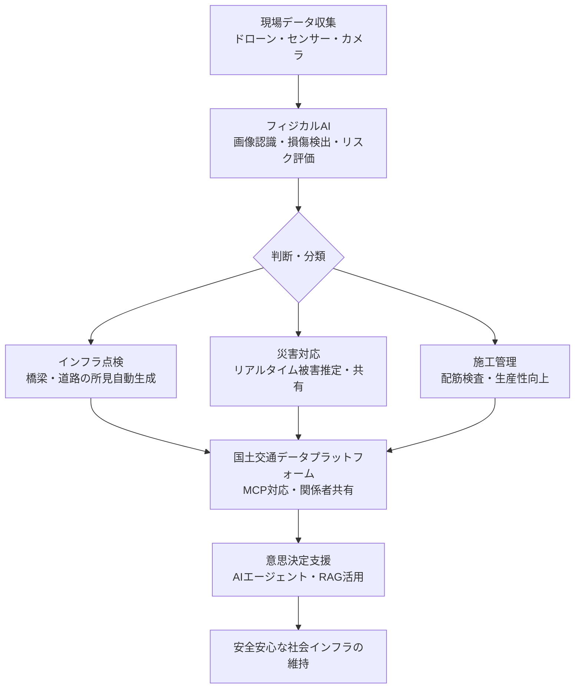
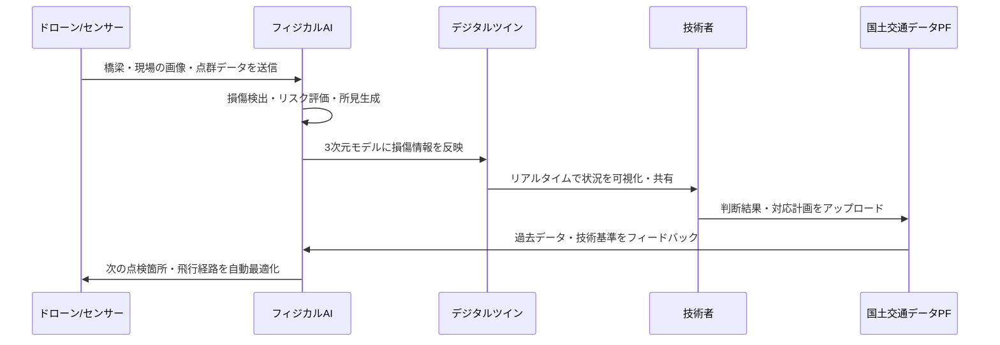

以下に記事を生成します。書籍については、検索結果で確認できた実在のKindle書籍のみを使用し、架空の情報は一切含めません。

## 土木×AIで変わる3つの現場革命！フィジカルAIがインフラを守る未来

本ページはプロモーションが含まれています

## 1. ざっくり言うと？（要約）

- 政府の「人工知能基本計画」策定を受け、AI分野での反転攻勢の機運が高まっており、日本の建設業界でも、インフラの維持管理などでフィジカルAIの適用が進んでいます。
- インフラマネジメントや災害対応の分野では、現実の空間を理解し、判断して、行動につなげる「フィジカルAI」について、現場と一体化したAI開発や利活用が進んでいます。
- 建設における人工知能市場は、2024年から2033年の間に20億米ドルから207億米ドルに成長すると予測されており、その年平均成長率は36%という驚異的な伸びを示しています。

## 2. もっと詳しく！（深掘り）

### インフラ点検にAIが「目」を持ちはじめた

橋や道路の点検現場を想像してみてください。これまでは熟練の技術者が写真を撮り、ひび割れや損傷を目で確かめて、報告書に手書きで記録するという作業の繰り返しでした。時間も人手も大量にかかる、まさに「職人技」の世界です。

点検画像に技術的に関連する情報を加えることで所見を生成するAIが開発されており、現場と一体化したAI開発や利活用が進んでいます。これはたとえると、「超優秀な新人エンジニアが24時間365日、疲れ知らずで写真を見続けて報告書を自動で書いてくれる」ようなイメージです。

近い将来、ドローンや建機運転はフィジカルAIによる自律化が視野に入るとみられており、UAV（ドローン）による橋梁点検の飛行経路をAIが最適化する研究も進んでいます。

### 災害対応を「その場で判断」するAI

地震被害調査画像から建物の被害状況をリアルタイムで推定し、災害時の調査を支援するAIシステムの試作開発も進んでいます。現場で撮影した写真を即座にAIが解析して「このビルはどの程度危険か」を判断してくれる、いわば「AIの現場調査員」です。人が危険な場所に踏み込む前に、まずAIが状況を把握してくれる時代が来ようとしています。

さらに、河道閉塞（土砂崩れなどで川がふさがれる災害）の対応で初動期の多様な情報をAIでリスク評価しながら、関係者で共有するシステムも開発されています。これにより、災害発生直後の「誰が何をすべきか」という混乱を大幅に減らすことができます。

### 国土交通省が「AIと話せる」データ基盤を整備中

インフラや災害などに関する情報は、AIとの接続に適する規格「MCP（Model Context Protocol）」に対応した形での国土交通データプラットフォームでの提供が進められており、地理空間情報の公開も始まっています。これは、「国のインフラデータ図書館」をAIが直接読みに行けるようにする取り組みです。AIが地図情報や過去の災害データを即座に参照できるようになると、判断のスピードと精度が格段に上がります。

### 構造をビジュアル解説（図解）

## 3. これだけは知っておきたい用語集

**フィジカルAI（Physical AI）**
「デジタルの世界にいるだけ」のAIではなく、カメラやセンサーを使って現実の空間を「見て・感じて・動く」AIのことです。スマートフォンの中に閉じ込められていたAIが、体を持って現場に飛び出してきたイメージです。フィジカルAIとは、現実世界における物理法則や環境との相互作用を理解し、自律的に行動するAIモデルのことを指します。

**デジタルツイン**
現実の橋や道路、河川を、コンピューターの中に「そっくりそのまま」コピーして作った仮想モデルのことです。現実に行われている従来業務をデジタル空間に移行するデジタルツイン技術を活用することで、データに基づく施工状況の把握・分析を行い、施工管理の省人化・省力化を図ることができます。

**MCP（Model Context Protocol）**
AIがさまざまなデータソースに「直接話しかけに行ける」ようにするための共通ルールです。図書館の「共通の目録システム」のようなもので、これがあるとAIが異なるデータベースをシームレスに横断して情報を取りに行けるようになります。

## 4. 【まず読むべき1冊】理解が一気に深まる本

> ここまで読んで「もっと知りたい」と思ったあなたへ

この記事を読んで「フィジカルAIって結局どういうことなんだろう？」と感じたなら、まさに今がこの本を手に取るタイミングです。

- **『フィジカルAI ー AIとロボットの融合が社会と仕事をどう変えるか』**（森 雅俊、林 裕一郎）
  - **この記事とのつながり**：この記事で繰り返し登場する「フィジカルAI」という概念の全体像を、産業・経営・社会の視点から体系的に整理した一冊です。土木・インフラ分野への応用がなぜ今起きているのか、その根本的な理由が腑に落ちます。
  - **読むとこうなる**：フィジカルAIの技術的基盤から産業・経営・社会への影響までを体系的に理解でき、生成AI・AIエージェント・ロボティクスの進化がどのように結びつき、工場、物流、医療、インフラなどの現場で何を変え始めているかを技術と実装の両面から把握できます。現場の上司や取引先に「フィジカルAIって何ですか？」と聞かれたとき、自分の言葉で説明できるようになります。
  - **こんな人に刺さる**：建設・土木業界でDXやAI導入を検討しているビジネスパーソン、現場で「AIを使え」と言われているが何から始めればよいかわからない技術者
  - **難易度**：★★☆☆☆（5段階）
  - **確認日**：2026-04-21
  - **確認できた事実**：Amazon.co.jpにてKindle版（ASIN: B0GR415C2K）として販売中を確認。著者名・書名・Kindle版の存在は確認済み。最新刊かどうかは未確認。

## 5. なぜこれが生まれたの？（ルーツ・背景）

### 人口減少と老朽化インフラという「二重苦」

日本のインフラは今、深刻な問題を抱えています。高度経済成長期に一斉に作られた橋や道路、トンネルが、いっせいに「老齢期」を迎えているのです。まるで、同じ年に生まれた人たちが一斉に定年を迎えるようなイメージです。

建設業では長時間労働が常態化している現状があり、災害時の復旧工事などでは臨時対応が常に求められるため、人材不足と高齢化の課題が深刻です。点検や補修をすべき構造物の数は増え続けているのに、担い手となる技術者は減り続けています。この「詰将棋」のような状況を打破するために、AIの活用が急速に注目されるようになりました。

### 日本が持つ「データの宝」という強み

特に日本は自然災害が多く、過去の災害記録やデータが膨大に残っており、トンネルや長大橋などの貴重な建設経験や老朽化構造物の維持管理記録なども豊富に存在します。これは、実は巨大な「AI学習教材」です。世界中の国々がまだ持っていないレベルの実データが日本には存在しており、これを活かせばフィジカルAI開発で世界をリードできる可能性があります。

### 政府の「AI基本計画」が後押し

政府では令和7（2025）年12月に「人工知能基本計画」を閣議決定しました。日本は大規模なAIの基盤モデルの投資規模では出遅れたものの、業界や業務に特化したアプリなどの具体的な付加価値の創出が重要となりつつあることから、広範な産業基盤を生かして反転攻勢に出る方針です。

## 6. どんな仕組みなの？（技術解説）

### 仕組みをわかりやすく解説

フィジカルAIが土木現場で「考えて動く」までの流れは、ざっくり次のようになります。

まずドローンやカメラが「目」となり、橋の表面や川の状態を大量の画像として収集します。これが「データの仕入れ」です。次に、その画像をAIが解析し、「このひび割れは危険」「この盛り上がりは異常」といった判断を下します。これが「頭脳による判断」です。そして最後に、その判断結果が専門家の手元に届けられ、補修の優先順位が決まります。

センシング情報を活用することで配筋検査の業務フロー自体を見直し、生産性を高める構想も生まれており、点群データから生成した3Dモデルを配筋検査やインフラ補修検測に活用する研究も進んでいます。

「点群データ」とは、レーザーで対象物を細かくスキャンして、無数の点の集まりとして立体的に再現するデータです。まるでプラネタリウムの星空を逆にして建物や地形を表現するようなイメージです。

### 動きをシミュレーション（図解）

## 7. 明日の仕事にどう活かす？（実務での活用）

### 建設会社・コンサル会社の技術者へ：「現場のデータ」を宝に変える

建設業界でのAI活用では、業務効率化が最も多くの目的として挙げられています。まずは業務プロセスの見直しやデータの標準化、社内での知見共有を進めることで、AIの活用範囲はさらに拡大するとされており、「まずは使ってみる」ことを第一歩とすることが重要です。

日々の現場で撮影している写真や測量データは、すでに「AIの学習素材」になり得ます。それをどう整理し、どう活用するかを考えるだけで、会社の強みに変わります。

### 自治体・公共インフラ管理者へ：「AIと話せる」データ整備が急務

現実に行われている従来業務をデジタル空間に移行するデジタルツイン技術を建設現場に導入することで、データに基づく施工状況の把握・分析を行い、施工管理の省人化・省力化を図ることができます。

管轄する橋や道路の点検記録をデジタル化し、標準的な形式で保存しておくだけで、将来のAI活用の扉が大きく開きます。「今すぐAIを導入する」より「AIが使えるデータを貯める」ことが今できる最大の投資です。

### 建設業に関わるすべての人へ：「人間しかできない仕事」を見極める

AIを搭載したシステムは、ウェアラブルデバイス、カメラ、センサーからのデータを分析して潜在的な危険を検知し、作業員にリアルタイムで警告を発することができます。

AIが「危険を感知して警告する」役割を担うことで、人間は「最終判断を下す」「地域住民に説明する」「創造的な設計をする」といった、AIには難しい仕事に集中できます。AIに仕事を「奪われる」のではなく、AIと「仕事を分担する」という発想が大切です。

## 8. あとがき

土木とAIの組み合わせ、最初は「なんだか縁遠い話」に感じるかもしれません。でも考えてみると、私たちが毎日渡る橋、通るトンネル、飲む水道水、すべてがインフラのおかげです。それらを守る技術者たちが、今まさに大きな転換点に立っています。

人口が減り、技術者が足りなくなっていく中で、AIは「仕事を奪う存在」ではなく「不可能を可能にするパートナー」になろうとしています。日本が持つ膨大な災害データと建設実績は、世界に誇れる財産です。その財産をAIと組み合わせることで、日本独自の「勝ち筋」が見えてくるはずです。

まだ答えは見えていないからこそ、今この分野に関わるすべての人にチャンスがあります。この記事が「最初の一歩」のきっかけになれば、これ以上嬉しいことはありません。

この記事が役立ったと感じたなら、ぜひ関連書籍もチェックしてみてください。読んで得た知識を、明日の現場や会議の場でどう使うかを考えながら読むと、理解が行動に変わる体験ができるはずです。

## 参考・引用元

https://built.itmedia.co.jp/bt/articles/2604/20/news013.html

## 9. 【行動したい人へ】さらに学びを深める書籍

> 「理解して終わり」ではなく「実務で使えるレベル」を目指す人へ

### 書籍5選

以下の書籍はすべて、Amazon.co.jpでの存在を確認したものを掲載しています。最新刊かどうかを断定できないものは「最新候補」として記載し、確認情報を明記しています。

**1. 最新候補**

- **『フィジカルAI ー AIとロボットの融合が社会と仕事をどう変えるか』**（森 雅俊、林 裕一郎）
  - **読むと何ができるようになるか**：生成AI・AIエージェント・ロボットの統合、産業別の実装事例、経営戦略・人材戦略への影響を体系的に把握でき、フィジカルAIを自社の戦略に組み込む議論ができるようになります。
  - **こんな人におすすめ**：建設・インフラ業界でAI戦略を立案したい管理職・経営者
  - **読んだ後どんな未来になるか**：「フィジカルAIとは何か」を人に説明できるようになり、社内での導入検討会議を自分でリードできます。
  - **難易度**：★★☆☆☆（5段階）
  - **確認日**：2026-04-21
  - **確認できた事実**：Amazon.co.jpにてKindle版（ASIN: B0GR415C2K）として販売中を確認。発売日・最新刊かどうかは未断定。

**2. 最新候補**

- **『フィジカルAI』**（サニー・ハム / Sunny Ham）
  - **読むと何ができるようになるか**：ロボット工学・自動運転・スマートファクトリーといった「身体」を得たAIが物理世界へ進出する革命を、技術・歴史・経済・倫理・哲学の多角的な視点から理解できます。
  - **こんな人におすすめ**：フィジカルAIの全体像を俯瞰したい初学者・学生・新入社員
  - **読んだ後どんな未来になるか**：AIが現実世界に出てきたときの社会変化を自分の言葉で語れるようになり、チームの勉強会でファシリテーターを務められます。
  - **難易度**：★☆☆☆☆（5段階）
  - **確認日**：2026-04-21
  - **確認できた事実**：Amazon.co.jpにてKindle版（ASIN: B0FVL68Y7Z）として販売中を確認。発売日・最新刊かどうかは未断定。

**3. 最新候補**

- **『フィジカルAIシステムの研究開発 〜身体性を備えたAIとロボティクスの融合〜』**（JST研究開発戦略センター（CRDS）、茂木 強 ほか）
  - **読むと何ができるようになるか**：センサーやアクチュエーターを介して環境と相互作用しつつ知能を発達させる身体性を備えたAI、すなわちフィジカルAIシステムの研究開発の方向性と技術的な論点を把握できます。
  - **こんな人におすすめ**：研究開発部門・技術戦略担当・大学院生など、より専門的な視点でフィジカルAIを理解したい人
  - **読んだ後どんな未来になるか**：日本の国家戦略としてのAI研究開発の位置づけを理解し、自社・自機関のR&D計画に活かせます。
  - **難易度**：★★★★☆（5段階）
  - **確認日**：2026-04-21
  - **確認できた事実**：Amazon.co.jpにてKindle版（ASIN: B0FQ93T7FL）として販売中を確認。発売日・最新刊かどうかは未断定。

**4. 最新候補**

- **『ゼロからはじめるフィジカルAI』**（hiro）
  - **読むと何ができるようになるか**：AIの「脳（LLM）」から「身体」への拡張プロセス、AIが現実世界を認識し行動するまでの仕組み、そして安全設計の実情を、専門知識なしに理解できます。
  - **こんな人におすすめ**：「フィジカルAIって聞いたことはあるけど難しそう」と感じている入門者全般
  - **読んだ後どんな未来になるか**：AIとロボットが融合する時代に向けて、自分のキャリアや業務をどう変えるべきかの具体的なヒントを手に入れられます。
  - **難易度**：★☆☆☆☆（5段階）
  - **確認日**：2026-04-21
  - **確認できた事実**：Amazon.co.jpにてKindle版（ASIN: B0G675XD2K）として販売中を確認。発売日・最新刊かどうかは未断定。

**5. 最新候補**

- **『建設DX デジタルがもたらす建設産業のニューノーマル』**（木村 駿、日経アーキテクチュア）
  - **読むと何ができるようになるか**：ゼネコンの研究開発2.0、リモートコンストラクション、BIM、建設3Dプリンター、建設×AIによる単純作業の効率化、スマートシティーへの展開まで、建設産業のDX全体像を体系的につかめます。
  - **こんな人におすすめ**：建設・土木業界で働いており、DXの全体像を短時間でつかみたいビジネスパーソン
  - **読んだ後どんな未来になるか**：業界の変化の文脈を理解した上で、自社のDX推進計画を具体的に描けるようになります。
  - **難易度**：★★☆☆☆（5段階）
  - **確認日**：2026-04-21
  - **確認できた事実**：Amazon.co.jpにてKindle版の存在を確認（ページ内にKindle for Web対応を記載）。発売日は紙書籍版として2021年頃発行を確認。Kindle最新刊かどうかは未断定。

## zennで使えるハッシュタグ

#フィジカルAI #建設DX #土木AI #インフラDX #デジタルツイン #ドローン点検 #生成AI #AIエージェント #国土交通省 #建設テック
