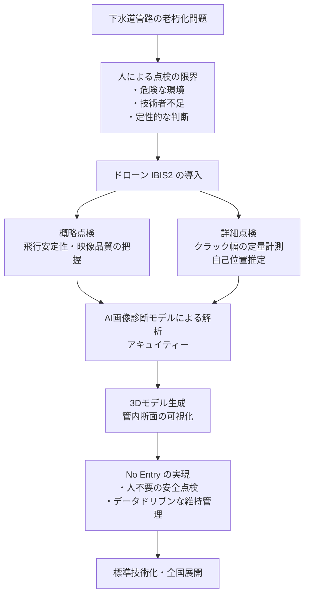
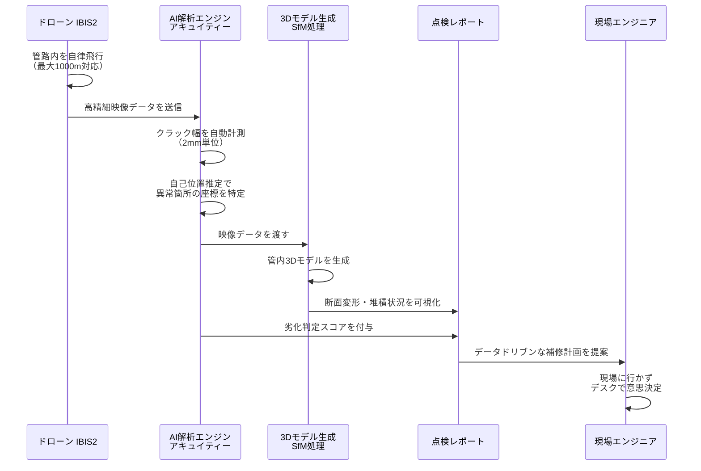

## 下水道点検が生まれ変わる！ドローン×AIで実現する3つの革命的変化

本ページはプロモーションが含まれています

## 1. ざっくり言うと？（要約）

- 管清工業・Liberaware・日水コン・アキュイティー・千葉市の5者連合が、国土交通省「AB-Crossプロジェクト」に採択され、下水道管路内のドローン×AI点検の実証事業を開始しました。
- 下水道管路内の狭くて暗い空間に対応するドローン「IBIS2」を中核に据え、AI画像解析と組み合わせることで、これまで「なんとなく見た目で判断」するしかなかった劣化状況を、数値データとして正確に把握できる技術の確立を目指しています。
- 人が絶対に入りたくないような危険な場所へのリスクをゼロにしながら、インフラの健康状態を「見える化」するという、安全と精度を同時に追求する挑戦です。

## 2. もっと詳しく！（深掘り）

### 3つの革命的変化とは何か

今回の実証事業が下水道点検にもたらす変化は、大きく3つに整理できます。

**革命1：「危険な現場」から「安全な遠隔監視」へ**

有毒ガスが漂い、暗くて狭く、増水のリスクもある下水道管路内に、人間が入らなくて済む「No Entry」の実現です。点検員の命のリスクを根本から排除します。

**革命2：「勘と経験」から「数値とデータ」へ**

これまでベテランの目に頼っていた劣化判定を、AIが「クラック幅2mm」「位置は管路の537m地点」といった客観的な数値で記録・評価します。人による判断のばらつきがなくなり、点検品質が均質化されます。

**革命3：「事後対応」から「予防保全」へ**

3Dモデルと定量データを組み合わせることで、「どこが・どれくらい・どのスピードで」傷んでいるかが可視化されます。壊れてから直すのではなく、壊れる前に手を打てる、データドリブンな維持管理が現実になります。

### 「見えない地下」が抱える深刻な問題

あなたの家の下には、縦横無尽に下水道のパイプが走っています。毎日使うトイレやお風呂の水を処理してくれる、まさに「街の血管」です。ところが、この血管の中は真っ暗で狭く、水が流れていて、有毒ガスが発生することもある。人間が入って点検するのは命がけです。

インフラ老朽化が深刻化する中、損傷が深刻化してから初めて大規模修繕を実施する「事後保全」から、適切な点検をもとに損傷が深刻化する前に修繕する「予防保全」への転換が求められています。さらに、技術者の減少という課題にも直面する中、安全に・正確に・効率よく点検できる手段が急務になっていました。

### 「IBIS2」とはどんなドローンなのか

今回の主役は、屋内点検用ドローン「IBIS2」です。これは「狭くて、暗くて、危険な屋内空間」の点検に特化した、いわば「地下探偵ロボット」です。

このドローンが持つ主な特徴は次の4点です。

- 狭小空間・高水位環境でも安定して飛べる
- 最大1,000m級の長距離管路に対応できる
- 防水・耐環境性能を強化している
- 幅2mmという微細なクラックを数値として計測できる

幅2mmといえば、シャープペンシルの芯2本分ほどの細さです。そんな傷を数値として記録できるというのは、医師がレントゲン写真を見て骨の状態を数字で診断するようなもの。「なんかヒビが入ってるな」から「ここは2mmのクラックが入っていて、あと何年で補修が必要」という会話に変わるわけです。

### AB-Crossプロジェクトとは何か

国土交通省では、B-DASHプロジェクト（下水道革新的技術実証事業）において新技術の研究開発・実用化を加速してきましたが、令和6年度に水道整備・管理行政が厚生労働省から国土交通省へ移管されたことを受け、水道革新的技術実証事業（A-JUMPプロジェクト）を創設し、さらに上下水道一体の技術開発を促進するため、AB-Crossプロジェクトとして発展させました。

つまり、これは「下水道だけ」「水道だけ」と縦割りで考えていた時代を終わらせ、上下水道を一体として革新的技術を育てようという、国家レベルの挑戦です。

### 構造をビジュアル解説（図解）

## 3. これだけは知っておきたい用語集

**No Entry（ノーエントリー）**
直訳すると「入らない」。人が危険な場所に踏み込まなくても、ロボットやドローンだけで点検・作業が完結する状態のことです。工事現場の安全旗を想像してください。「人が入らないこと＝最大の安全」という発想から生まれた概念です。

**自己位置推定**
ドローンが「今自分は管路のどのあたりを飛んでいるか」を自力で計算する技術です。GPSが届かない地下でも、カメラや各種センサーのデータをもとに自分の場所を把握します。カーナビがGPS電波の届かないトンネルの中でも「あと300m先を右折」と案内できるイメージに近いです。

**SfM（Structure from Motion）**
複数の写真をAIが解析して、3次元の立体モデルを作り出す技術です。ドローンで撮影した管内の映像から、パイプの内側の形・ゆがみ・堆積物を3Dモデルとして再現します。考古学者が遺跡の写真から3Dモデルを作るのと同じ仕組みを、暗い地下管路に応用しています。

## 4. 【まず読むべき1冊】理解が一気に深まる本

> ここまで読んで「もっと知りたい」と思ったあなたへ

この記事の「ドローンとAIがインフラ点検をどう変えるか」という問いに、実証事例と技術的背景の両面から答えてくれる本があります。

- [ドローンビジネス調査報告書2026【インフラ・設備点検編】](https://amzn.to/4vIzPRl)（青山祐介・インプレス総合研究所）
  - **この記事とのつながり**：小型ドローンや屋内飛行が可能なドローンの登場により、下水道管の中など今まで点検が行えなかったフィールドへのドローン活用も動き出しているという本書の指摘は、まさに今回のIBIS2実証事業の「なぜ今か」を理解する地図になります。
  - **読むとこうなる**：「ドローン点検ってどこまでビジネスになるの？」という疑問が解消され、インフラ×ドローン×AIの市場規模・プレイヤー・ビジネスモデルを俯瞰した視点で今回のニュースを読み解けるようになります。
  - **こんな人に刺さる**：インフラ業界・建設業界で新規事業を検討している方、ドローン関連ビジネスへの参入を考えている方
  - **難易度**：★★☆☆☆

## 5. なぜこれが生まれたの？（ルーツ・背景）

### 「橋が落ちてから直す」時代の終焉

日本のインフラの多くは高度経済成長期（1960〜70年代）に集中して建設されました。当時「50年後に全部老朽化する」なんて想像もしなかったでしょう。しかし今、その「50年後」が現実になっています。

国土交通省は2014年に「インフラ長寿命化計画（行動計画）」を策定し、損傷が軽微な段階で補修を行うことで施設を長寿命化させる「予防保全」の考え方を示しました。さらに2021年には、予防保全への本格転換と新技術・官民連携手法の普及促進等を軸とした第2次計画を策定しています。

### 技術者不足という「もう一つの危機」

点検の現場では、もう一つの危機が静かに進んでいます。それは「点検できる人間が減っている」という現実です。高度な専門知識を持つベテラン技術者が引退し、後継者の育成が追いつかない。AIとドローンへの期待は、この問題への解決策でもあります。

点検品質を「人の経験」に頼るのではなく「データと数値」で担保する仕組みを作ることが、今回の実証事業の本質的な価値です。

## 6. どんな仕組みなの？（技術解説）

### 仕組みをわかりやすく解説

今回の点検は、「概略点検」と「詳細点検」を組み合わせた2段階方式です。まずドローンが管路を飛んで全体の状態をざっと把握し（概略点検）、問題がありそうな箇所を特定したうえで、AIが精密に解析する（詳細点検）という流れです。

AIが担う役割は「劣化判定の数値化」です。ドローンが撮影した映像からクラックの幅を自動計測し、その場所を管路全体のどの位置かを誤差±5%以内で特定します。さらにSfM技術で3Dモデルを生成し、断面の変形や泥の堆積状況まで把握できるようになります。

### 動きをシミュレーション（図解）

## 7. 明日の仕事にどう活かす？（実務での活用）

### 自治体・インフラ管理者：「いつ補修するか」が数値で決まる時代へ

これまで下水道管路の補修計画は、ベテラン技術者の「経験と勘」に頼る部分が大きくありました。今後この技術が標準化されれば、「クラック幅2mm・位置は管路の537m地点・劣化進行速度は年0.3mm」といった具体的なデータをもとに、補修の優先順位を科学的に決定できるようになります。予算の使い方が根本から変わります。

### 建設・インフラ企業：新しいビジネスチャンスの読み方

国土交通省への水道行政移管で導入拡大が見込まれる水管橋のドローン点検や、狭所ドローン点検の利用分野拡大が進んでいます。今回のAB-Cross採択は、官民連携でドローン×AI点検が「実験」から「標準技術」へ移行するターニングポイントです。自社のソリューションをこの流れに乗せられるか、今が正念場です。

### IT・AI開発者：「産業AI」のリアルな課題を知る

今回のAI活用で重要なのは「精度」だけではなく、「暗くて狭い環境での安定稼働」「水や振動への耐性」「位置推定の精度」という、実環境ならではの制約条件です。AIによる画像診断やデータ解析、ドローンによる無人点検システムは、「人による点検・調査」を補完する技術として近年注目を集めています。画像認識AIを「きれいな実験室」ではなく「過酷な現場」で動かすノウハウは、あらゆる産業AIに応用できる最前線の知見です。

## 8. あとがき

「地面の下で何が起きているか、私たちは何も知らない」という事実に、この記事を書きながら改めて気づかされました。毎朝トイレを流すたびに、その水がどんな管路を通り、どんな状態の配管に支えられているのかを考えたことがある人は、ほとんどいないでしょう。

今回のドローン×AI実証事業が目指す「No Entry」は、単なる効率化の話ではありません。危険な場所に人を送り込まなくて済む社会、データで正直にインフラの健康状態を把握できる社会、それが実現したとき、私たちの「当たり前の日常」はもっと強くなります。

技術の進化は突然ではなく、こういった地道な実証実験の積み重ねで生まれます。この記事が、足元の「見えないインフラ」への関心を少し高めるきっかけになれば嬉しいです。関連書籍も手に取ってみてください。読んで理解したことが、行動に変わりますよ。

## 参考・引用元

https://prtimes.jp/main/html/rd/p/000000076.000105097.html

## 9. 【行動したい人へ】さらに学びを深める書籍

> 「理解して終わり」ではなく「実務で使えるレベル」を目指す人へ

### 書籍2選

以下の書籍は、Amazon.co.jpでの実在が確認できたものを中心に掲載しています。Kindle版の有無や最新情報については、各書籍のAmazon商品ページで直接ご確認ください。

- [実践 生成AIの教科書――実績豊富な活用事例とノウハウで学ぶ](https://amzn.to/4cI3S3a)（日立製作所 Generative AIセンター）
  - **読むと何ができるようになるか**：一般的なデスクワークからコールセンター、システム開発、社会インフラの維持・管理、データサイエンスまで、AI活用のノウハウを習得でき、インフラ点検AIをどう業務に組み込むか具体的に考えられるようになります。
  - **こんな人におすすめ**：AIを「社会インフラ管理」の文脈で実務活用したい方、企業内でAI導入を推進する担当者
  - **読んだ後どんな未来になるか**：生成AIを社会インフラ維持管理の現場に当てはめた思考回路が身につき、今回のような実証事業の意義を自社業務に翻訳できるようになります。
  - **難易度**：★★★☆☆

- [生成AIで世界はこう変わる](https://amzn.to/4tu2Oae)（今井翔太、SB新書）
  - **読むと何ができるようになるか**：AI技術全体の大きな潮流を理解し、「なぜ今AIがインフラ点検に使われるのか」という文脈を自分の言葉で説明できるようになります。
  - **こんな人におすすめ**：AIの話題についていきたいが入門書を探している方、ドローン×AIニュースの背景を知りたい方
  - **読んだ後どんな未来になるか**：AI技術の進化の方向性が見えるようになり、インフラDXのニュースを深く読み解く基礎体力がつきます。
  - **難易度**：★☆☆☆☆

## zennで使えるハッシュタグ

#ドローン #インフラ点検 #AI #下水道 #IoT #DX #画像解析 #社会インフラ #スマートシティ #建設テック

## Xでこの記事を紹介する文章

毎日トイレを流しているのに、その下の配管がどんな状態か、誰も知らない。

国土交通省が採択した実証事業で、ドローン×AIが「地下の血管」を数値で診断する時代が始まりました。幅2mmのヒビを自動計測し、人が一切入らずに点検が完結する「No Entry」の世界へ。

インフラDXの最前線、詳しく解説しています。

#ドローン #インフラ点検 #AI #下水道DX #建設テック
