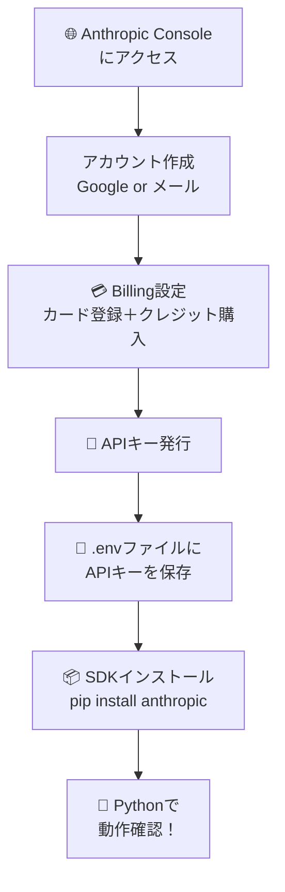
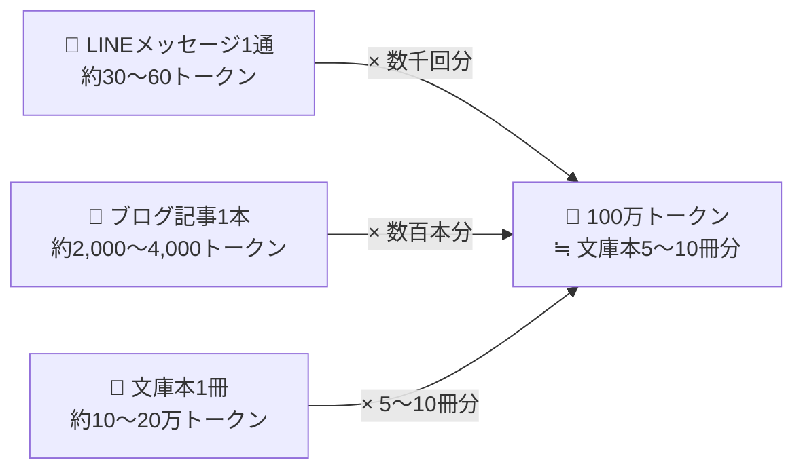
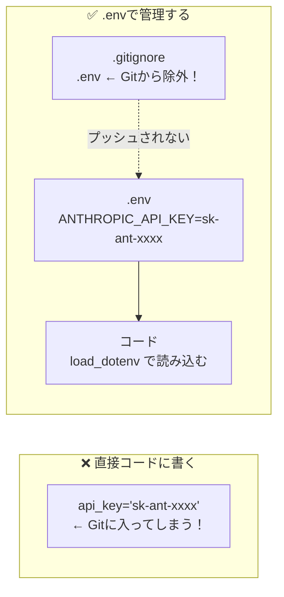
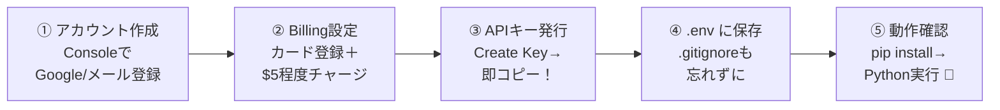

「Claude APIを使ってみたいけど、何から始めればいいかわからない…」という方向けの入門記事です。アカウント作成からPythonで実際にAPIを叩くところまで、順番にやっていきましょう！

## 全体の流れ

まず何をするのか、全体像をつかんでおきましょう。



たったこれだけです。一つひとつ見ていきましょう。

## Step 1. アカウントを作成する

[Anthropic Console](https://console.anthropic.com/) にアクセスして、アカウントを作ります。

- **Googleアカウント**か**メールアドレス**で登録できます
- どちらでもOK！Googleログインが一番ラクです

## Step 2. クレジットをチャージする

Claude APIは**使った分だけ料金がかかる従量課金制**です。先払いでクレジットを購入しておく仕組みになっています。

Consoleの左メニューから **「Billing」** を開いて、クレジットカードを登録してチャージしましょう。

> 💡 最初は**5ドル（約750円）** 程度チャージするだけで十分です。テストなら全然余ります。

### 料金の目安（2026年4月時点）

| モデル | 入力 | 出力 | こんな用途に |
|---|---|---|---|
| Claude Haiku 4.5 | $1 | $5 | 高速・激安。大量処理やテスト向き |
| Claude Sonnet 4.6 | $3 | $15 | バランス型。業務利用にも◎ |
| Claude Opus 4.6/4.7 | $5 | $25 | 最高性能。難しいタスクやコーディングに |

単位は **「100万トークンあたり」** です。

### 🤔 100万トークンってどれくらい？

「トークン」という単位がピンとこない方も多いと思います。日本語では **1文字 ≒ 1〜2トークン** が目安です。

| コンテンツ | おおよそのトークン数 |
|---|---|
| LINEのメッセージ1通（30文字） | 約30〜60トークン |
| ブログ記事1本（2,000文字） | 約2,000〜4,000トークン |
| 文庫本1冊（10万文字） | 約10〜20万トークン |
| **100万トークン** | **文庫本 約5〜10冊分** |

つまり Claude Haiku 4.5 なら、**文庫本5〜10冊分の入力テキストを処理しても $1（約150円）** ということです。日常的なチャットやテスト用途なら、かなり余裕があることがわかりますね。




## Step 3. APIキーを発行する

APIキーは、「このリクエストは自分のアカウントから来てますよ」と証明するためのパスワードみたいなものです。

1. Consoleの **「API Keys」** セクションに移動
2. **「Create Key」** をクリック
3. 表示されたキーを**すぐにコピー**する

:::message alert
⚠️ **APIキーはこのとき1回しか表示されません！** 画面を閉じると二度と見られないので、必ずどこかにメモしておきましょう。
:::


## Step 4. APIキーを .env で管理する

APIキーをコードに直接書くのは**絶対NGです**。うっかりGitHubにpushしてしまうと、見知らぬ誰かに不正利用される危険があります。

`.env` ファイルに書いて、コードと分けて管理しましょう。

### なぜ .env で管理するの？



### やり方

まず `python-dotenv` をインストールします。

```bash
pip install anthropic python-dotenv
```

プロジェクトのルートに `.env` ファイルを作って、APIキーを書きます。

```bash
# .env
ANTHROPIC_API_KEY=sk-ant-ここに自分のキーを貼る
```

次に、`.gitignore` に `.env` を追加して、Gitの管理から除外します。

```bash
# .gitignore に追記
.env
```

:::message
`.gitignore` がまだない場合は、プロジェクトのルートに新規作成してください。
:::


## Step 5. Pythonで動作確認！

準備が整ったら、いよいよ実際にAPIを叩いてみます。

`test_claude.py` というファイルを作って、以下のコードを貼り付けてください。

```python
from dotenv import load_dotenv
import anthropic

# .envファイルからAPIキーを読み込む
load_dotenv()

# クライアントを初期化（APIキーは自動で .env から読まれる）
client = anthropic.Anthropic()

# メッセージを送信
message = client.messages.create(
    model="claude-haiku-4-5",  # テスト用は安いHaikuがおすすめ！
    max_tokens=256,
    messages=[
        {"role": "user", "content": "こんにちは！自己紹介してください。"}
    ]
)

# 返答を表示
print(message.content[0].text)
```

実行してみましょう。

```bash
python test_claude.py
```

こんな感じの返答が出れば成功です🎉

```
こんにちは！私はAnthropicが開発したAIアシスタントのClaudeです。
テキストの読み書き、質問への回答、コーディングのサポートなど、
さまざまなタスクをお手伝いできます。何かご質問はありますか？
```


## 補足：コードを書かずにブラウザで試したい場合

Pythonを触る前にまず動きを見てみたい！という方は、Consoleの **[Workbench](https://console.anthropic.com/workbench)** が便利です。

ブラウザ上でプロンプトを入力してレスポンスを確認できるので、「どんな返答が来るか雰囲気をつかみたい」というときに重宝します。


## まとめ



つまずいたところや「こんなことできる？」という疑問があればぜひコメントへ！

最新のモデル情報や詳細なAPIの使い方は [公式ドキュメント](https://docs.anthropic.com/) もチェックしてみてください。
